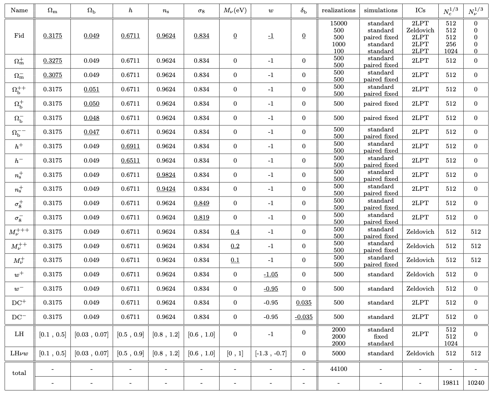

Data Access
===========

The data is stored in the three different supercomputers in San Diego, New York, and Princeton. It can be access through `globus <https://www.globus.org/>`_. 

- Log in into `globus <https://www.globus.org/>`_ (create an account if you dont have one).
- To access the data in San Diego type: Quijote_simulations (or with this `link1 <https://app.globus.org/file-manager?origin_id=feb85190-bafb-11ea-9a42-0255d23c44ef&origin_path=%2F>`_)
- To access the data in New York type: Quijote_simulation2 (or with this `link2 <https://app.globus.org/file-manager?origin_id=e0eae0aa-5bca-11ea-9683-0e56c063f437&origin_path=%2F>`_)
- To access the data in Princeton type: Princeton TIGRESS QUIJOTE Snapshots (or with this `link3 <https://app.globus.org/file-manager?origin_id=8ce7cdf0-7e85-11ea-97a5-0e56c063f437&origin_path=%2F>`_)

Note that to download the data to your local machine (e.g. laptop) you will need to install the globus connect personal. For further details see `here <https://github.com/franciscovillaescusa/Quijote-simulations/blob/master/documentation/globus.md>`_.

There are different folders:

- **Snapshots**. This folder contains the snapshots of the simulations
- **Halos**. This folder contains the halo catalogues
- **Voids**. This folder contains the void catalogues
- **Linear_Pk**. This folder contains the linear power spectra of each cosmological model
- **Pk**. This folder contains the power spectra
- **Marked_Pk**. This folder contains the marked power spectra
- **Bk**. This folder contains the bispectra 
- **CF**. This folder contains the correlation functions
- **PDF**. This folder contains the pdfs
- **density_field**. This folder contains the 3D density fields
- **density_field_2D**. This folder contains the 2D density fields

Inside each of the above folders there is the data for the different cosmologies, e.g. h_p, fiducial, Om_m. A brief description of the different cosmologies is provided in the below table. Further details can be found in the `Quijote paper <https://arxiv.org/abs/1909.05273>`_.

