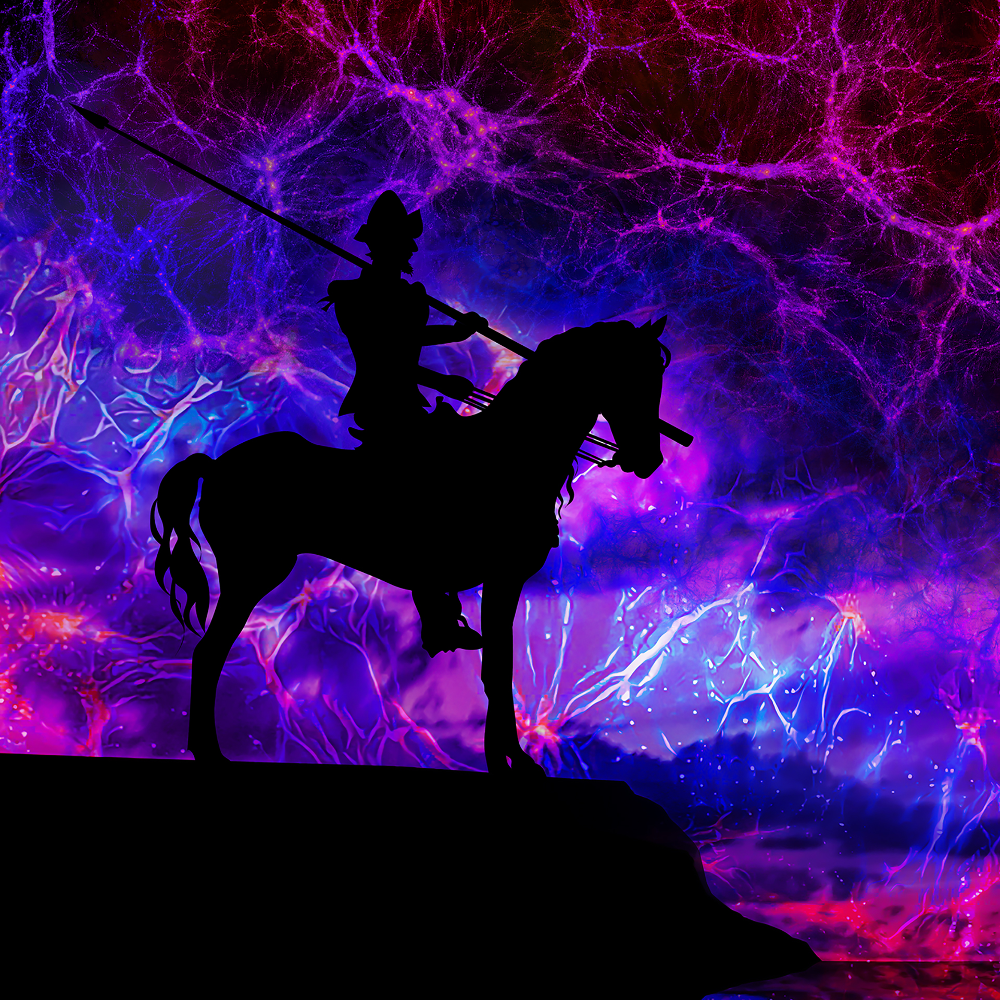
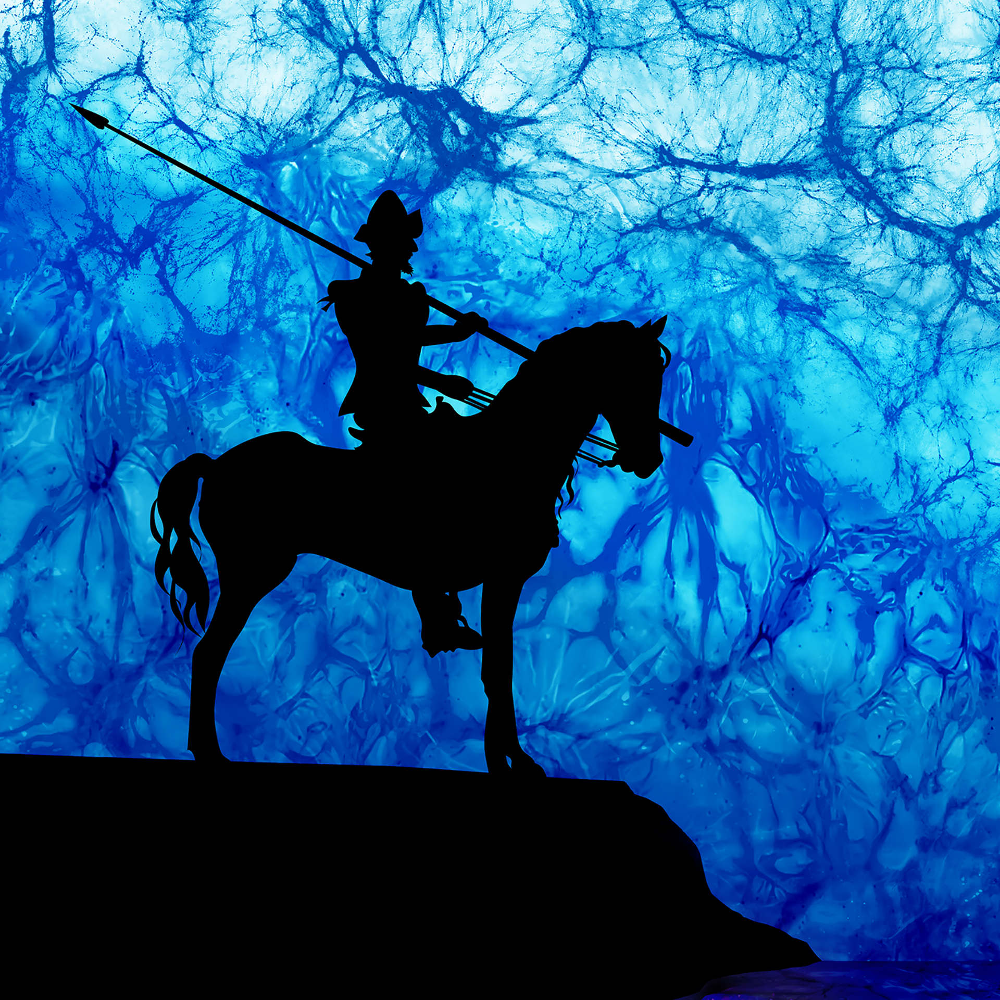
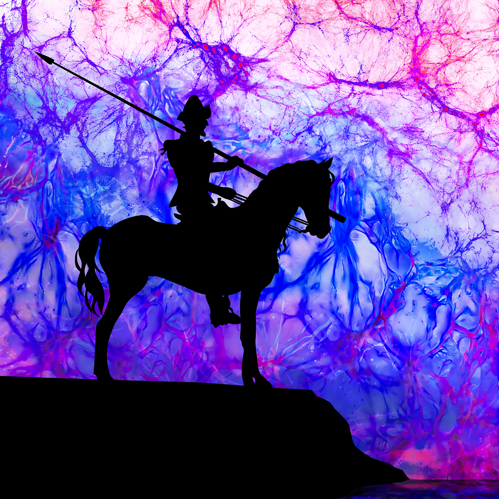

*********
Logo
*********

The below gif image has been created by linearly interpolating two images: 1) an image of the large-scale structure from one Quijote simulation, and 2) an image created by using the DeepDream software on top of 1). The goal of the animation is to emphasize and highlight regions of the cosmic web in a novel way.

.. image:: logo.gif
   :width: 65 %
   :align: center

The images below show `Don Quijote <https://en.wikipedia.org/wiki/Don_Quixote>`_ riding his horse with the sky showing the large-scale structure of the Universe from its `traditional` version (top-right) to its `machine learning` version (bottom-left).

