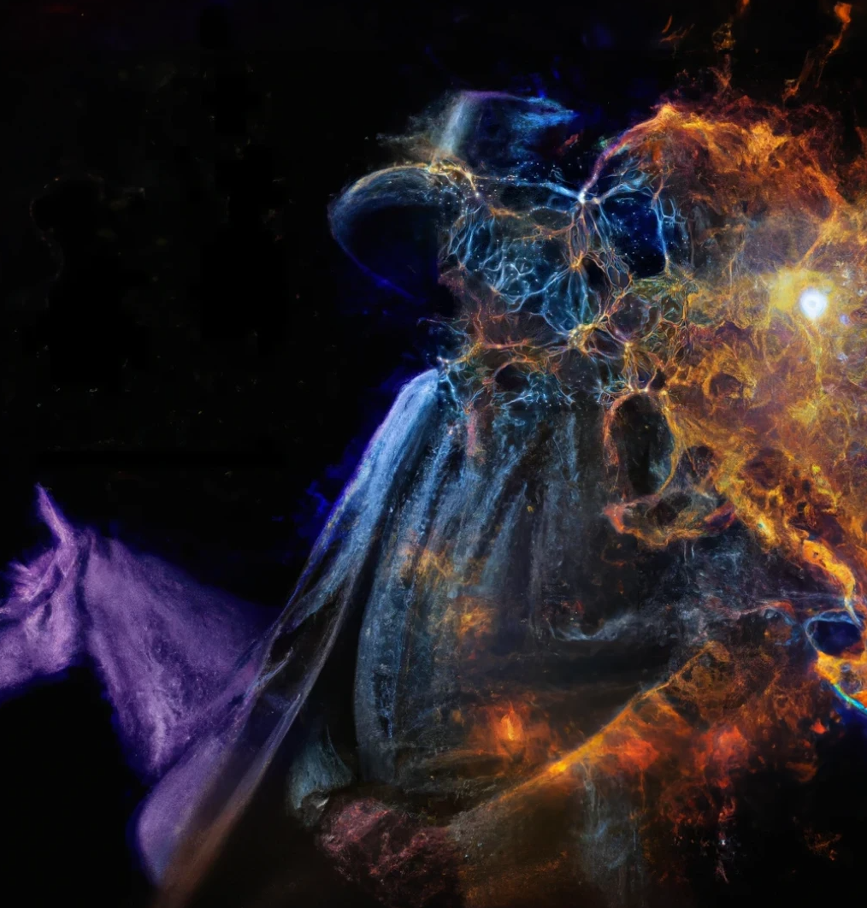

.. _Sancho:

************
Sancho Suite
************

The Sancho Suite of galaxy mock catalogs consist of :math:`240,000` galaxy catalogs in redshift-space scanning across 11 cosmologies, 3 massive neutrino cosmologies, 6 non-Gaussian initial conditions and 11 Halo Occupation Distribution (HOD) model parameters. The average number density of each 
box is :math:`n_g \sim 3 \times 10^{-4} \,(h/\textrm{Gpc})` at :math:`z=0.5` and they are generated from the halo catalogs of 
`Quijote simulations <https://arxiv.org/abs/1909.05273>`_, each run with :math:`512^3` particles on a :math:`1\, (\textrm{Gpc}/h)^3` box. The fiducial HOD model is tailored such that the catalogs mock the CMASS galaxies observed by BOSS.

Organization
------------

The **Sancho catalogs** are organized in the following way:

   - :math:`15,000` mocks at the fiducial cosmological and HOD parameter values.
   - :math:`172,500` mocks at :math:`23` different cosmological/HOD parameter values and :math:`45,000` mocks at different amplitudes of different types of non-Gaussian initial conditions. For each cosmology and HOD set of values, there are :math:`500` N-body realizations and, for each of these, :math:`5` realizations of the HOD are run, making a total of :math:`2500` mocks.
   - Redshift space displacements are computed in the distant observer approximation along each of the axes. There are three different files for each realization/redshift.

Cosmologies and HOD implementation
----------------------------------

We vary 5 cosmological parameters, :math:`\Omega_m`, :math:`\Omega_b`, :math:`h`, :math:`n_s` and :math:`\sigma_8` 
plus the sum of massive neutrinos :math:`\sum m_\nu` and 3 different types of primordial non-Gaussianities, 
:math:`f_{\textrm{NL}}^{\textrm{local}}`, :math:`f_{\textrm{NL}}^{\textrm{equil}}` and :math:`f_{\textrm{NL}}^{\textrm{equil}}`, 
following the same naming and step convention as the rest of the Quijote suite.

The HOD model adopted is as described in `Zheng et al <https://arxiv.org/abs/astro-ph/0703457>`_ and it consists of 5 parameters: 

    - :math:`M_{\textrm{min}}` is the lowest mass of a halo that can host any galaxy
    - :math:`\sigma_{\log M}` regulates the central galaxy occupation, which is modeled as a Bernoulli distribution
    - The satellite galaxy distribution is a Poisson distribution with a mean that depends on three parameters: :math:`M_0`, :math:`M_1`, and :math:`\alpha`.

> The code implementing this HOD algorithm has been developed by Juan Calles and is freely available `here <https://gitlab.com/jcallesh/hod>`_ . 

We summarize all cosmologies and HOD models in the following table:

+----------+----------------------------------------+------------------+-----------+-------------+------------------+--------------------+------------------------------------------+------------------------------------------+------------------------------------------+-------------------------------+-------------------------+------------------+----------------+------------------+--------------+
|          | Cosmological Parameters                                                                                                                                                                                                                                      |  HOD parameters                                                                                                               |
+==========+========================================+==================+===========+=============+==================+====================+==========================================+==========================================+==========================================+===============================+=========================+==================+================+==================+==============+
| name     | :math:`\Omega_m`                       | :math:`\Omega_b` | :math:`h` | :math:`n_s` | :math:`\sigma_8` | :math:`\sum m_\nu` | :math:`f_{\textrm{NL}}^{\textrm{local}}` | :math:`f_{\textrm{NL}}^{\textrm{equil}}` | :math:`f_{\textrm{NL}}^{\textrm{ortho}}` | :math:`\log M_{\textrm{min}}` | :math:`\sigma_{\log M}` | :math:`\log M_0` | :math:`\alpha` | :math:`\log M_1` | realizations |
+----------+----------------------------------------+------------------+-----------+-------------+------------------+--------------------+------------------------------------------+------------------------------------------+------------------------------------------+-------------------------------+-------------------------+------------------+----------------+------------------+--------------+
| fiducial | 0.3175                                 | 0.049            | 0.6711    | 0.9624      | 0.834            | 0                  | 0                                        | 0                                        | 0                                        | 13.0                          | 0.2                     | 13.1             | 0.75           | 14.25            | 15,000       |
+----------+----------------------------------------+------------------+-----------+-------------+------------------+--------------------+------------------------------------------+------------------------------------------+------------------------------------------+-------------------------------+-------------------------+------------------+----------------+------------------+--------------+
| step     | 0.01                                   | 0.002            | 0.02      | 0.02        | 0.015            | \*                 | 100                                      | 100                                      | 100                                      | 0.025                         | 0.025                   | 0.2              | 0.2            | 0.2              | 500          |
+----------+----------------------------------------+------------------+-----------+-------------+------------------+--------------------+------------------------------------------+------------------------------------------+------------------------------------------+-------------------------------+-------------------------+------------------+----------------+------------------+--------------+

    \* As for the mass of neutrinos, :math:`M_\nu`, there are three steps corresponding to the total mass of neutrinos of 0.1, 0.2, and 0.4 eV.

.. Cosmological models v.2
.. -----------------------

.. The fiducial cosmological parameter values are :

.. - :math:`\Omega_m = 0.3175`
.. - :math:`\Omega_b = 0.049`
.. - :math:`h=0.6711`
.. - :math:`n_s = 0.9624`
.. - :math:`\sigma_8 = 0.834`
.. - :math:`f_{\rm NL}^{\rm local} = 0`
.. - :math:`f_{\rm NL}^{\rm equil} = 0`
.. - :math:`f_{\rm NL}^{\rm ortho} = 0` 
 
.. The non-fiducial cosmological parameter values are varied using a step :math:`\Delta\theta` above or below the fiducial value of the following amplitudes

..     \{ :math:`\Delta\Omega_m`, :math:`\Delta\Omega_b`, :math:`\Delta h`, :math:`\Delta n_s`, :math:`\Delta \sigma_8` \} = \{0.01, 0.002, 0.02, 0.02, 0.015\}.

.. For the mass of neutrinos, :math:`M_\nu`, there are three steps corresponding to the total mass of neutrinos of 0.1, 0.2, and 0.4 eV.
.. As for the step on :math:`\Delta f_{\rm NL}^{\rm local}`, :math:`\Delta f_{\rm NL}^{\rm equil}`,  and :math:`\Delta f_{\rm NL}^{\rm ortho}` are 100.

.. The HOD model adopted is as described in `Zheng et al <https://arxiv.org/abs/astro-ph/0703457>`_.
.. For the fiducial parameters of our HOD model, we use the following values:

..     \{:math:`\log M_{\rm min}`, :math:`\sigma_{\log M}`, :math:`\log M_0`, :math:`\alpha`, :math:`\log M_1`\} = \{13.0, 0.2, 13.1, 0.75, 14.25\}. 

.. - :math:`M_{\rm min}` is the lowest mass of a halo that can host any galaxy
.. - :math:`\sigma_{\log M}` regulates the central galaxy occupation, which is modeled as a Bernoulli distribution
.. - The satellite galaxy distribution is a Poisson distribution with a mean that depends on three parameters: :math:`M_0`, :math:`M_1`, and :math:`\alpha`.

.. > The code implementing this HOD algorithm has been developed by Juan Calles and is freely available `here <https://gitlab.com/jcallesh/hod>`_. 

Access to data
--------------

Sancho can be accessed through the dedicated folder in `Globus <https://app.globus.org/file-manager?origin_id=37b8e8c6-6679-11ed-b0bb-bfe7e7197080&origin_path=%2F>`_.
Folders are organized in the same way as the rest of the Quijote suite: */Cosmology/#realization/files*

Inside each of these directories you can find the following products:

- Catalogs in Python binary including position, velocity and type (central or galaxy),
- Power spectrum measurements including monopole, quadrupole and hexadecapole (see details in the next section),
- Bispectrum measurements, for now monopole only, quadrupole coming soon!

The file naming for catalogs have the following structure:

``A_HOD_B_NFW_C_1Gpc_z0.50_D_E.npz``

where

- A: cosmology with the same naming convention as Quijote products (fiducial,Om_p,Om_m,...)
- B: HOD set of parameters. 'fid' is the fiducial set, and the rest of parameters are named as in previous section, using '_m' and '_p' to indicate steps.
- C: ID of HOD realization (from 0 to 4)
- D: RSD direction (1:x, 2:y, 3:z)
- E: ID of run
  
Example: ``Mnu_p_HOD_fid_NFW_sample0_1Gpc_z0.50_RSD3_run0.npz``

For power spectrum and bispectrum measurements, files have an additional string ``ps_sancho`` and ``bisp_sancho``, respectively, at the beginning of the file name, and the file format is ``.dat``.

Metadata
----------

To access relevant metadata of each catalog, a simple code `metadata.py` is available at the parent folder of the Sancho suite.
Usage:

.. code-block:: shell

    python metadata.py --cat_file "catalog_file.npz"

The code will output a JSON file with metadata listing cosmology, simulation , HOD and measurements specifications.

How to read catalogs
--------------------

After download, the catalogs can be used in Python with the following script:

.. code-block:: python

    import numpy as np
    filename = 'filename.npz'
    cat = np.load(filename)
    pos = cat['pos']        # shape: (N_galaxies, 3) --> X,Y,Z position of each galaxy in Mpc/h
    vel = cat['vel']        # shape: (N_galaxies, 3) --> Vx, Vy, Vz velocity of the galaxy in km/s
    gtype = cat['gtype']    # shape: scalar --> Type of galaxy, central: 1, satellite: 0

Power spectrum and Bispectrum
-----------------------------

We measure the  galaxy redshift power spectrum using the public code `PBI4 <https://zenodo.org/records/10008045>`_. 
We use a fourth-order density interpolation and interlacing scheme described in `Sefusatti et al <https://arxiv.org/abs/1512.07295>`_. 
Bins have width of :math:`\Delta k = 2 k_f`, where :math:`k_f=0.006 h/Mpc` is the fundamental frequency of the box, and are computed up to :math:`k_{\rm max} = 0.3 h/Mpc`.

The structure of the Power spectrum files is:

    :math:`k\,\,` | :math:`\,\,k_{\textrm{avg}}\,\,` | :math:`\,\,P_0(k)\,\,` | :math:`\,\,P_2(k)\,\,` | :math:`\,\,P_4(k)\,\,` | :math:`\,\,N_{\textrm{modes}}\,\,`

where :math:`k_{\textrm{avg}}` is the value of :math:`k` inside a bin averaged over the bin, in units of :math:`h/Mpc`.
:math:`P_0`, :math:`P_2` and :math:`P_4` are the monopole, quadrupole and hexadecapole, respectively. The units of  the power spectra are :math:`(\textrm{Mpc}/h)^3`.
On the third line of each file, you can find two numbers, corresponding to the number of galaxies for this catalog, and the related Poisson shot-noise.

In python, the files can be read as 

.. code-block:: python
		
    import numpy as np
    filename = 'ps_sancho_fiducial_HOD_fid_NFW_sample0_1Gpc_z0.50_RSD1_run1.dat'
    k, avgk, pk,avgP2, avgP4, Nmodes= np.loadtxt(filename, unpack=True)

To get shot-noise:

.. code-block:: python

    def getSN(filename):
        f = open(filename)
        fline = f.readline()
        fline = f.readline()
        fline = f.readline()
        psn = float(fline.split(' ')[-1])
        f.close()
        return psn

Using the same binning, we also measure the bispectrum for each galaxy catalog, resulting in 1654 triangles up to :math:`k_{\textrm{max}} = 0.3 h/\textrm{Mpc}`.

The structure of the Bispectrum files are: 

    :math:`\,\,k_1/k_f\,\,` | :math:`\,\,k_2/k_f\,\,` | :math:`\,\,k_3/k_f\,\,` | :math:`\,\,P(k_1)\,\,` | :math:`\,\,P(k_2)\,\,` | :math:`\,\,P(k_3)\,\,` | :math:`\,\,B(k_1,k_2,k_3)\,\,` | :math:`\,\,B(k_1,k_2,k_3)+{\textrm{SN}}\,\,` | :math:`\,\,N_{\textrm{tr}}\,\,`

where :math:`{\textrm{SN}} = 1/n^2 + (P(k_1) + P(k_2) + P(k_3)) / n` is the bispectrum Poisson shot-noise and :math:`N_{\textrm{tr}}` is the number of triangles in a give triangle bin.

In python, the files can be read as 

.. code-block:: python
		
    import numpy as np

    k1, k2, k3, Pk1, Pk2, Pk3, B0, B0+BSN, N_tri= np.loadtxt(filename, unpack=True)

Team
----

The Sancho Suite of galaxy mock catalogs was developed in 2023 by:

- Matteo Biagetti (Area Science Park, Italy)
- Juan Calles (PUCV, Chile)
- Jacky Yip (UW–Madison, USA)
- Emilio Bellini (IFPU, Italy)

If you use data from Sancho, please cite the `Yip, Biagetti, Cole, Bellini, Calles, Shiu (2023) <https://arxiv.org/abs/xxxx.xxxxx>`_.
