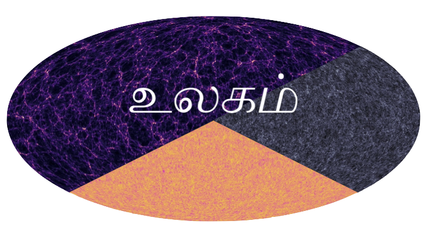

.. _ulagam:

Ulagam simulations
==================

The Ulagam simulations are companion runs to Quijote, and in particular, are full-sky lightcone simulations that are consistent with the Quijote initial conditions. The Ulagam suite has around 4,000 N-body simulations that are primarily meant for (i) Fisher forecasting of cosmology parameters related to wCDM or to primordial non-gaussianity, and (ii) estimating covariances for various data vectors. There are 2,000 simulations at fiducial cosmology, and 100 each for the various +/- parameter values.

For details see `the Ulagam website <https://ulagam-simulations.readthedocs.io>`_.

Team:

- Dhayaa Anbajagane (Chicago)
- Chihway Chang (Chicago)
- Hayden Lee (Chicago)
- Marco Gatti (Upenn)
